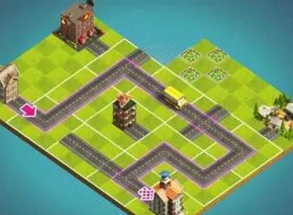

# Construyendo Ciudades

Nos piden herramientar parte del modelo de un juego donde el objetivo es construir ciudades.

## Trabajadores 
De cada trabajador se registra su edad, o sea cuántos años tiene. Debe poder obtenerse: la fuerza, la habilidad y si es o no importante. fuerza y habilidad son dos valores numéricos. En principio, corresponden estas definiciones:
- la habilidad es de 12 para las trabajadores de entre 20 y 40 años, y de 8 para las otras.
- la fuerza es de 20 para todos los trabajadores.
- un trabajador es importante si tiene, exactamente, 25 ó 35 años. O sea, si un trabajador tiene 25 años es importante, si tiene 35 años es importante, si tiene cualquier otra edad no es importante.

## Trabajadores especializados
Además de estas definiciones que sirven para la generalidad de las trabajadores, se definen algunos tipos de trabajadores con características especiales. En principio vamos a contemplar a los arquitectos y los ingenieros.

## Arquitectos
De cada arquitecto se mantiene la concentracion (que comienza en 4 unidades) y la cantidad de técnicas que conoce (que comienza en 2).
La fuerza de un arquitecto es la suma del valor común para todos los trabajadores, con la multiplicación entre concentración y cantidad de técnicas que conoce.
Un arquitecto es importante si cumple la condición común para todos los trabajadores, o bien, conoce más de 5 técnicas.
Definir las siguientes dos acciones para los arquitectos:
- diseñar una cantidad de días: el efecto es sumar a la masa muscular 1 kilo por cada 5 días de diseñamiento. P.ej. el efecto de diseñar 15 días, es sumar 3 kilos a la masa muscular.
- aprender una técnica: el efecto es sumar uno a la cantidad de técnicas que conoce el arquitecto.

## Ingenieros
De cada ingeniero se conoce la cantidad de premios que obtuvo, que arranca en 0.
La habilidad de un ingeniero es la suma del valor común para todas las trabajadores, con el doble de la cantidad de premios. Un ingeniero es importante si tiene más de 3 premios.

¡Atención! la condición general para considerar a un trabajador como importante no corre para los ingenieros, o sea, un ingeniero que tenga 3 o menos premios nunca es importante, aunque tenga p.ej. 25 años.

## Ciudades
De cada ciudad se conocen sus trabajadores y la cantidad de edificios que hay.
Se tiene que poder obtener, para cada ciudad
- la equipo profesional, que está formada por los trabajadores importantes.
- si es famosa: la condición es que haya al menos dos edificios, y que todos los trabajadores tengan al menos 10 unidades de habilidad.
- la fuerza total: es la suma de la fuerza de todos los trabajadores.

## Test sobre el escenario básico
Considerar estas seis trabajadores:
- Julieta, una trabajadora genérica de 42 años.
- Ana, una arquitecta de 25 años.
- Rosa, una arquitecta de 45 años que conoce 8 técnicas.
- Perla, una arquitecta de 28 años que conoce 4 técnicas, y de concentración 6.
- Mónica, una ingeniera de 45 años con 3 premios.
- Luisa, una ingeniera de 35 años con 1 premio.

Verificar que tienen los valores indicados en la tabla que sigue: 

| trabajador | fuerza | habilidad | Es importante |
|----------|----------|----------|----------|
| Julieta | 20 | 8 | no | 
| Ana | 28 | 12 | sí |
| Rosa 52 | 8 | sí |
| Perla | 44 | 12 | no |
| Mónica | 20 | 20 | sí |
| Luisa | 20 | 14 | no |

Considerar el ciudad Tritón, que tiene a estas seis trabajadoras. Verificar que:
- el equipo profesional está formada por Ana, Rosa y Mónica
- no es un ciudad famosa
- la fuerza total es 184

Sugerencia: definir a los trabajadores como un Set, para simplificar el chequeo del equipo profesional.

Finalmente, en un test aparte, hacer que Perla diseñe 15 días y aprenda una técnica. Después de eso, la fuerza tiene que ser 65, y todavía no tiene que ser importante. Después hacer que aprenda una técnica más. Después de aprender esta segunda técnica adicional, Perla tiene que ser importante.

## Más sobre las ciudades
Agregar, para cada ciudad, la longitud total de sus calles, que está medida en kilómetros. Agregar también dos acciones
- construir calles: suma una cantidad que se indica a la longitud de las calles.
- fundar un edificio: suma uno a la cantidad de edificios de la ciudad.
Agregar las siguientes consultas para un ciudad:
- fuerza aparente: es la fuerza del trabajador más fuerte, multiplicada por la cantidad de trabajadores del ciudad. P.ej. si un ciudad tiene 4 trabajadores con fuerza 20, 28, 35, y 40, entonces la fuerza aparente es 40 * 4 = 160. En el mismo caso, la fuerza total es 123.
- si necesita reforzarse: la condición es que la fuerza aparente sea el doble de la total o más.

Y la siguiente acción: recibir tributos. Cuando ocurre esto, cada trabajador ofrece su tributo a la ciudad. Para un ingeniero, el tributo es fundar un edificio. Para un arquitecto, es construir 2 kilómetros de calles. Los trabajadores genéricas no tienen nada que ofrecer; cuando se les pide que ofrezcan su tributo a un ciudad, no hacen nada.

## Valor de cada trabajador
Agregar la capacidad de preguntarle a cualquier trabajador su valor, que es la suma de fuerza más habilidad. Para los ingenieros, se suman 5 unidades adicionales.
Se debe poder consultar, para un ciudad, la colección de trabajadores valiosos, que son aquellos cuyo valor es de 40 o más.

## Dominar a otra ciudad
Definir para un ciudad, la acción de extender su dominio sobre otra ciudad. Lo que debe ocurrir es que cada trabajador valioso de la ciudad dominada ofrezca su tributo a la ciudad dominadora.
P.ej. si tenemos dos ciudades, Tritón y Paleas, y se le pide a Tritón que domine a Paleas, el efecto debe ser que todos los trabajadores valiosos de Paleas ofrezcan su tributo a Tritón.
